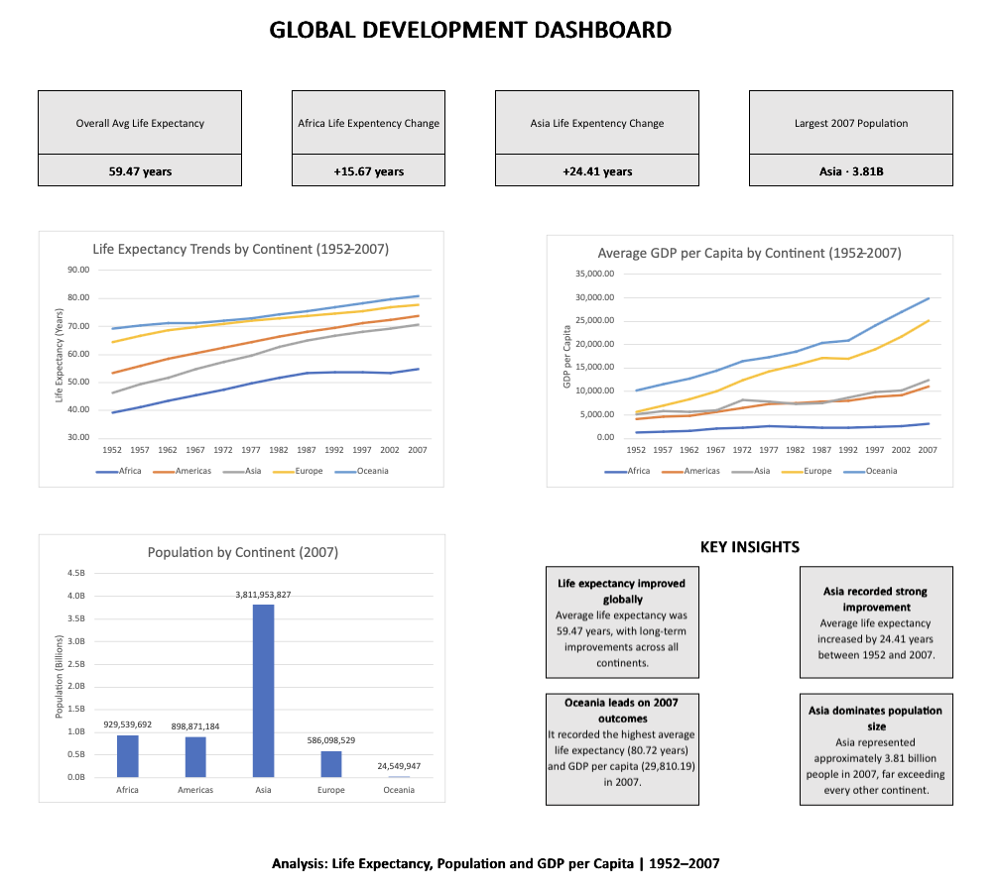

# Global Development Indicators Analysis

An Excel-based analysis of global development trends in **life expectancy, population, and GDP per capita** across five continents from **1952 to 2007**.

The project demonstrates an end-to-end Excel analysis workflow, including data cleaning, quality checks, calculated fields, PivotTable analysis, data visualisation, dashboard development, and interpretation of key findings.

## Dashboard

## Project Objectives

The aim of this project was to analyse long-term global development patterns and answer several key questions:

- How has average life expectancy changed across continents over time?
- Which continents experienced the greatest improvements in life expectancy?
- How does GDP per capita vary between continents and over time?
- How was the global population distributed across continents in 2007?
- Which continents recorded the highest life expectancy and GDP per capita by 2007?

## Dataset

The analysis uses Gapminder-style development data covering **1952–2007** across five continents:

- Africa
- Americas
- Asia
- Europe
- Oceania

Three main development indicators were analysed:

| Indicator | Description |
|---|---|
| `LIFE_EXP` | Life expectancy in years |
| `POP_TOTAL` | Total population |
| `GDP_PC` | GDP per capita |

The workbook preserves the original data separately from the cleaned analytical dataset, allowing the data preparation and analysis stages to remain clearly separated.

## Data Preparation & Excel Techniques

The raw data was preserved in a separate worksheet before creating a cleaned dataset for analysis. This allowed the original source data to remain unchanged while transformations and validation checks were performed separately.

Key preparation and analysis techniques included:

- **Data quality checks** to identify invalid, missing, or negative values.
- **IF, AND and ISNUMBER** logic to create validation flags.
- **FLOOR** to group observations into decades for time-based analysis.
- **Nested IF statements** to categorise life expectancy values into bands.
- **VLOOKUP** to map indicator codes to broader development dimensions.
- **COUNTIF** and **AVERAGEIF** for conditional aggregation.
- **PivotTables** to compare indicators across years and continents.
- **PivotCharts** to visualise long-term trends and continental differences.
- **Filtering and aggregation** to isolate specific indicators and analyse 2007 outcomes.
- **Dashboard design** to combine KPIs, charts and analytical insights into a single stakeholder-facing view.

## Workbook Structure

| Worksheet | Purpose |
|---|---|
| `raw_data` | Preserves the original source data |
| `cleaned_data` | Contains the cleaned dataset and derived analytical fields |
| `quality_checks` | Documents data validation and quality checks |
| `calculated_fields` | Contains formula-based calculations and headline metrics |
| `pivot_analysis` | Contains PivotTables used for aggregated analysis |
| `charts` | Contains the main analytical visualisations |
| `dashboard` | Presents KPIs, charts and key insights in one view |
| `Insights_Report` | Summarises the main analytical findings and conclusions |

## Key Findings

### Life Expectancy

- Average life expectancy across the dataset was approximately **59.47 years**.
- Life expectancy improved across all five continents over the study period.
- **Asia recorded an increase of approximately 24.41 years** between 1952 and 2007.
- **Africa recorded an increase of approximately 15.67 years** over the same period.
- In 2007, **Oceania had the highest average life expectancy at approximately 80.72 years**, followed by Europe at approximately 77.65 years.

### Economic Development

- GDP per capita increased substantially over the study period, although large differences remained between continents.
- In 2007, **Oceania recorded the highest average GDP per capita at approximately 29,810.19**.
- **Europe followed at approximately 25,054.48** in 2007.

### Population

- **Asia had the largest population represented in the dataset in 2007, at approximately 3.81 billion people**.
- This substantially exceeded the other continental groups represented in the analysis.

## Conclusion

The analysis shows broad improvements in health and economic indicators between 1952 and 2007, while also highlighting substantial differences between continents. It demonstrates that life expectancy, population size and GDP per capita capture different dimensions of development and should be considered together when interpreting long-term development patterns.

## Tools & Skills Demonstrated

**Tool:** Microsoft Excel

**Data Analysis**
- Data cleaning and validation
- Data quality checking
- Conditional aggregation
- Data categorisation and feature creation
- Trend analysis
- Comparative analysis

**Excel**
- IF, AND and ISNUMBER
- Nested IF statements
- COUNTIF and AVERAGEIF
- VLOOKUP
- FLOOR
- Excel Tables
- PivotTables and PivotCharts
- Filtering and aggregation
- Chart formatting
- KPI development
- Dashboard design

**Communication**
- Data visualisation
- KPI reporting
- Analytical insight generation
- Stakeholder-focused dashboard design
- Written analytical reporting

## Explore the Project

To explore the full analysis:

1. Download the Excel workbook from this repository.
2. Open the workbook in Microsoft Excel.
3. Start with the `dashboard` worksheet for the high-level results.
4. Review `Insights_Report` for the written analysis.
5. Explore `pivot_analysis` and `calculated_fields` for the underlying calculations.
6. Review `cleaned_data` and `quality_checks` to see the data preparation process.

---

*This project was developed as part of my Data Analyst portfolio to demonstrate practical Excel-based data preparation, analysis, visualisation and reporting skills.*
